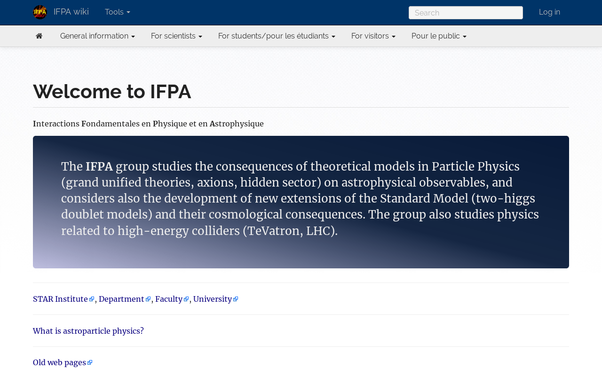

# Bootstrap Mediawiki

This is an updated version of the excellent [Bootstrap MediaWiki skin](https://github.com/borkweb/bootstrap-mediawiki) by Matthew Batchelder. This version is updated to be compatible with and up to [MediaWiki 1.31rc0](https://www.mediawiki.org/wiki/Download), and to mirror the crisp look of the Bootswatch theme [Readable](https://bootswatch.com/3/readable/).

This version of the theme is used to serve the [IFPA group's website](http://www.theo.phys.ulg.ac.be/wiki/Welcome_to_IFPA) at the [Université de Liège](https://www.uliege.be/). The custom branding to cater to the IFPA are contained separately in the [custom.css](custom.css) file, and is not used by default. You may choose to explicitly specify `$wgSiteCSS = 'custom.css';` in your `LocalSettings.php` to use it. This, possibly along with minor adjustments to [style.css](style.css), is also where you would want to add in your customisation.



## License ##
The theme is licensed for use under the terms of the GNU General Public License as published by the Free Software Foundation; either version 2 of the License, or (at your option) any later version.

This theme is distributed in the hope that it will be useful, but WITHOUT ANY WARRANTY; without even the implied warranty of MERCHANTABILITY or FITNESS FOR A PARTICULAR PURPOSE. See the GNU General Public License for more details.

You should have received a copy of the GNU General Public License along with this program; if not, write to the Free Software Foundation, Inc., 51 Franklin Street, Fifth Floor, Boston, MA 02110-1301, USA.

See [LICENSE](LICENSE) for more details.

## Installation
First, clone the repository into your `skins/` directory.

```
git clone https://github.com/badshah400/bootstrap-mediawiki.git BootstrapMediaWiki
```

Next, in `LocalSettings.php` set:

```
wfLoadSkin( 'BootstrapMediaWiki' );
$wgDefaultSkin = 'bootstrapmediawiki';
```

<br />
The **post-installation setup** for this version of the theme follows the [original](http://borkweb.github.io/bootstrap-mediawiki/), and is reproduced here for completeness.

## Setup
Once you've enabled the skin, you'll want to create a few pages.

### Customization Vars

There are some customizations you can do to the theme by placing some variables in your `LocalSettings.php` file

Variable | Description
---------|------------
`$wgNavBarClasses` | Add additional classes to the navbar (example: `navbar-inverse` to get the black navbar). Example: `$wgNavBarClasses = 'navbar-inverse';`
`$wgSitenameShort` | Use this if you wish for your nav title to use a shorter name than your wiki's name. Example: `$wgSitenameShort = 'Short name';`
`$wgTOCLocation` | Moves the Table of Contents (when one exists) into a sidebar. Usage: `$wgTOCLocation = 'sidebar';`
`$wgSiteCSS` | Adds a custom CSS file so you can run your own CSS without customizing the base theme styles. Example: `$wgSiteCSS  = 'custom.css';`
`$wgSiteJS` | Adds a custom JS file so you can run your own JS. Example: `$wgSiteJS  = 'custom.js';`

### Useful templates for your wiki

#### Create: Bootstrap:Footer
This MediaWiki page will contain what appears in your footer.  For example:

```html
<div class="row">
	<div class="col-md-6">
		=== Stuff ===
		* [[Link to some place]]
		* [[Another link]]
	</div>
	<div class="col-md-6">
		=== More Stuff ===
		* [http://external.resource.org Go here]
	</div>
</div>
```


#### Create: Bootstrap:TitleBar / Bootstrap:Subnav
This MediaWiki page will control the links that appear in the Bootstrap navbar after the logo/site title.  The format that this page is expecting is as follows:

```
* Menu Item Title
** [[Page 1]]
** [[Page 2]]
** [[Page 3]]
* Another Menu
** [[Whee]]
** [[OMG hai]]
* [[A Link Menu]]
```

You can use this page to create dynamic menus, too! If you have an extension providing a parser function, this will get evaluated before the menu is displayed.
An interesting example is the usage of the [DynamicPageList third-party Extension](http://www.mediawiki.org/wiki/Extension:DynamicPageList_%28third-party%29) (BEWARE: not the MediaWiki one; maybe this works when you wrap this inside a {{#tag:}} to create a parser function on demand):

```
* Menu Item Title
{{#dpl:category=Dynamic Menu Pages|format=,** [[%PAGE%|%TITLE%]],\n,}}
```

You can name the category whatever you want, of course. Do not change the format string, as it will be needed as is by the template functions! But of course every other params for this function are possible...

The Bootstrap:Subnav page follow the same syntax as does the Bootstrap:TitleBar page. As the name already suggests, it will create a sub-navigation bar under the title bar.

#### Create: Template:Alert
This template is used to leverage Bootstrap's alert box:

```html
<div class="alert {{{2}}}"><strong>Heads Up!</strong> {{{1}}}</div>
```

Usage:
```
{{alert|Message you want to say|alert-danger}}
```

#### Create: Template:Tip
This template is used to do Bootstrap tooltips!

```html
<span title="{{{2}}}" class="tip" rel="tooltip">{{{1}}}</span>
```

Usage:

```
{{tip|Something|This is the tooltip!}}
```

or

```
{{tip|[[Bacon]]|Delicious snack}}
```

#### Create: Template:Pop
This template is used to do Bootstrap popovers!

```html
<span title="{{{2}}}" data-content="{{{3}}}" data-toggle="popover">{{{1}}}</span>
```

Usage:

```
{{pop|Whatever triggers the popover|Popover Title|Popover Content}}
```
